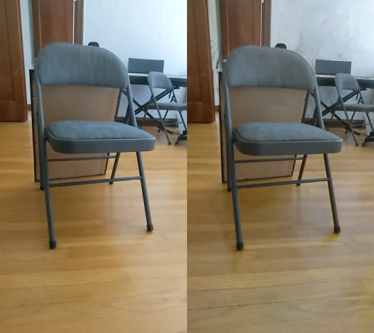
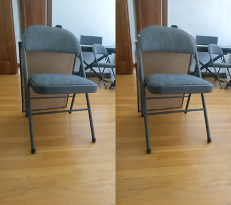
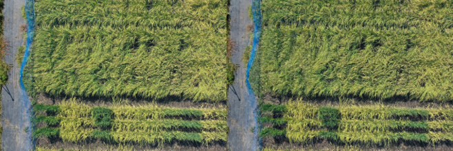
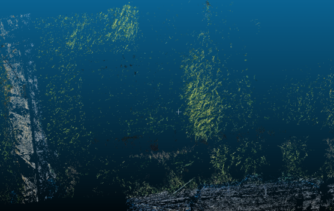
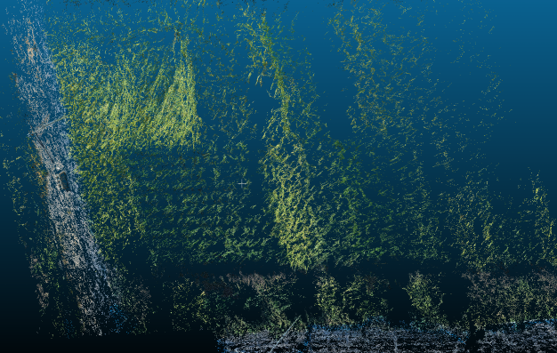

# 研究概要
日本の稲作では圃場の生育状況を3次元的に把握することが
収量予測や管理効率化に重要。

# 課題
UAV空撮画像は撮影視点に物理的な限界があり、
側面情報の欠如による画像の偏りが3次元復元精度を低下させる。

# アプローチ
- 新規視点画像のレンダリングによるデータ拡張
- NeRFと3DGSの有効性をPoC比較し、3DGSを採用
- 生成画像と実画像間の特徴点マッチングによる整合性の確認

# 結果

## NeRF vs 3DGS PoC比較

### 標準テクスチャ（Posterデータセット）での比較

| NeRF | 3DGS |
|------|------|
|  |  |

### 実験水田（稲穂圃場）での比較

| NeRF | 3DGS |
|------|------|
| [NeRF](images/nerf_rice.png) | ! |

### 定量評価結果

| データセット | 手法 | PSNR↑ | SSIM↑ | LPIPS↓ |
|---|---|---|---|---|
| Poster | NeRF | 18.93 | 0.765 | 0.210 |
| | **3DGS** | **34.33** | **0.965** | **0.090** |
| 実験水田 | NeRF | 16.33 | 0.131 | 0.504 |
| | **3DGS** | **19.96** | **0.587** | **0.202** |

標準テクスチャでは両手法とも一定の精度が得られたが、
稲穂圃場では繰り返しパターンによる高テクスチャの影響で
両手法ともに精度が低下。全指標で3DGSがNeRFを上回ったため3DGSを採用。
農業ドメイン特有の難しさも明らかになった。

## 基準データによる3次元復元とデータ拡張後の3次元復元

| 基準データによる3次元復元 | データ拡張後の3次元復元 |
|---|---|
|  |  |

3DGSによる新規視点レンダリングをデータ拡張に用いることで、稲穂の形状がより鮮明に再現され、空白領域の補完に成功。

## 今後の課題
- 点群データを用いた収量予測
- ground truth取得と点群の定量評価
- レンダリング精度向上のためのアルゴリズム改良