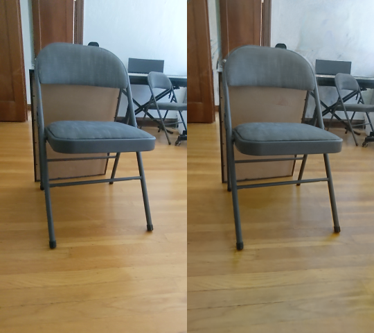
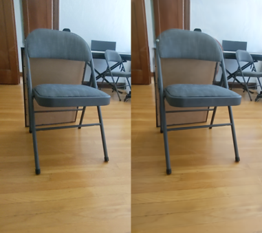
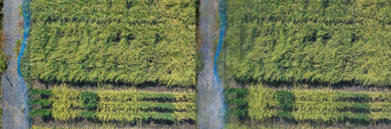
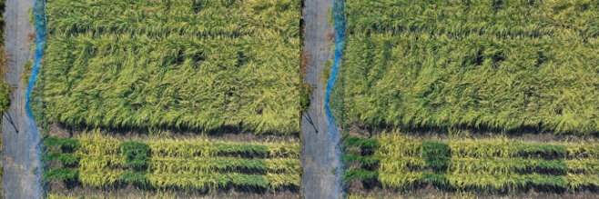
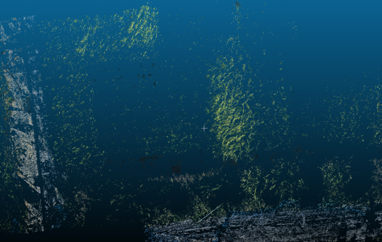
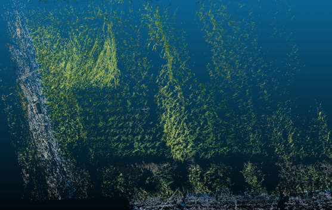

# 研究概要
日本の稲作では圃場の生育状況を3次元的に把握することが
収量予測や管理効率化に重要。
本研究では農学部との共同研究で実験水田のUAV空撮画像を用い、以下の2段階で研究を進めている。

| 段階 | テーマ | 状況 |
|---|---|---|
| 学部 | [UAV空撮画像からの稲穂圃場の3次元復元精度向上](#学部uav空撮画像からの稲穂圃場の3次元復元精度向上) | 完了 |
| 修士 | [3次元点群を直接入力とした収量予測](#修士3次元点群を直接入力とした収量予測) | 進行中 |

# 研究意義
### 収量予測のメリット
- 経営面:不作のダメージを減らし資金繰りをスムーズに行える
- 作業の面:収穫に向けた農機や肥料・人員の準備を最適化できる
- 売り先の面：事前にお米の買い手に納品予定量を伝えられるので取引がしやすくなる

### 圃場を3次元点群にするメリット
- 生育状況の可視化・定量化：広大な圃場を見て回る労力を削減しながら生育ムラや倒伏のリスクを発見
- 圃場記録のデジタル化・比較：年ごと・区画ごとの3Dデータを蓄積・比較して圃場の変化を客観的に追跡することで年ごとの施策の影響を精密に記録することができる。

---

# 学部：UAV空撮画像からの稲穂圃場の3次元復元精度向上

## 課題
UAV空撮画像は撮影視点に物理的な限界があり、
側面情報の欠如による画像の偏りが3次元復元精度を低下させる。

## アプローチ
- 新規視点画像のレンダリングによるデータ拡張
- NeRFと3DGSの有効性をPoC比較し、3DGSを採用
- 生成画像と実画像間の特徴点マッチングによる整合性の確認

## 結果

### PoC比較 (NeRF vs 3DGS) 

#### Posterデータセット（標準テクスチャ）での比較

| NeRF(左:元画像、右:レンダリング画像) | 3DGS (左:元画像、右:レンダリング画像)|
|------|------|
|  |  |

#### 実験水田（高周波テクスチャ）での比較

| NeRF(左:元画像、右:レンダリング画像) | 3DGS(左:元画像、右:レンダリング画像) |
|------|------|
|  |  |

#### 定量評価結果

| データセット | 手法 | PSNR↑ | SSIM↑ | LPIPS↓ |
|---|---|---|---|---|
| Poster | NeRF | 18.93 | 0.765 | 0.210 |
| | **3DGS** | **34.33** | **0.965** | **0.090** |
| 実験水田 | NeRF | 16.33 | 0.131 | 0.504 |
| | **3DGS** | **19.96** | **0.587** | **0.202** |

標準テクスチャでは両手法とも一定の精度が得られたが、
稲穂圃場では繰り返しパターンによる高周波テクスチャの影響で両手法ともに精度が低下。
全指標で3DGSがNeRFを上回ったため3DGSを採用。
農業ドメイン特有の難しさも明らかになった。

### 基準データによる3次元復元とデータ拡張後の3次元復元

| 基準データによる3次元復元 | データ拡張後の3次元復元 |
|---|---|
|  |  |

3DGSによる新規視点レンダリングをデータ拡張に用いることで、稲穂の形状がより鮮明に再現され、空白領域の補完に成功。

## 残課題
- ground truth取得と点群の定量評価
- レンダリング精度向上のためのアルゴリズム改良

---

# 修士：3次元点群を直接入力とした収量予測

コード：[Point_net_for_my_research](https://github.com/you-tkhs/Point_net_for_my_research)

## 概要
区画ごとの3次元点群そのものを入力として、収量を直接予測するアプローチに取り組んでいる。

## アプローチ
- SfMで年度ごとに圃場を3次元復元し、区画ごとに点群を切り分ける
- 正解ラベルは区画ごとの収量(g/m²)
- PointNetの分類モデルを回帰用に改良したベースラインを実装
- 年度によって収量水準が大きく異なるため、収量を年度ごとに標準化して学習
- 学習データが少ないため、k分割交差検証で評価
- 入力に色(r,g,b)・法線(nx,ny,nz)を追加できるよう拡張
- PointNet++(MSG)ベースの回帰モデルも実装

## 今後の展望
- モデル・評価方法・入力の改善による予測精度の検証

---

# 学部と修士の研究の接続
学部で取り組んだ3次元復元は、修士の収量予測の入力データを作る工程にあたる。
